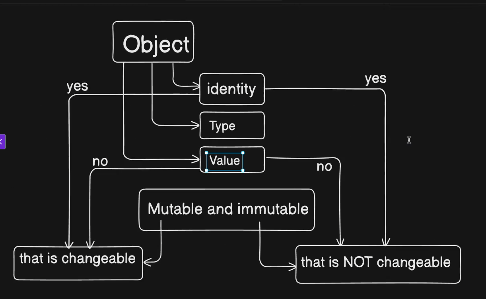

# Objects and Immutable vs Mutable

In Python, everything is an object. This includes not only data types like integers, strings, and lists, but also functions, classes, and even modules. Each object has a unique identity, a type, and a value.

## Immutable vs Mutable Objects

- **Always check with the identity of the object using the id() function. If the id changes after an operation, it means a new object has been created i.e the original object is immutable.**

In Python, objects can be classified as either mutable or immutable:

1. **Immutable Objects**: Means the value of the object is not changed after it is created. Examples include:
   - Integers
   - Strings
   - Tuples => ()

2. **Mutable Objects**: Means the value of the object can be changed after it is created. Examples include:
   - Lists -> []
   - Dictionaries -> {}
   - Sets -> set()
   - Custom Objects (instances of user-defined classes)

## Integers

